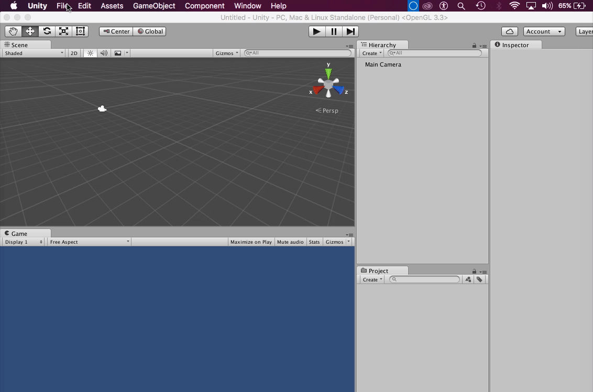

# CodeCampUnity3D Workshop
Tutorial for a CodeCamp 2017 workshop on unity 3D.
We have provided a packet of assets to help build a rolling the ball tutorial.

## Steps
1. Click "Clone or Download" > "Download ZIP" to download the Unity Package
	- Extract the contents of the ZIP
	- Note when your extracted it. You will be using this for later

2. Create new project in Unity3D
	- Launch Unity and click "NEW"
	- Name your project and select a location
	- Click "Create Project"

3. Import the Unity Package
	- Once you've created a new project, navigate to the toolbar of your Unity window and
	click "Assets" > "Import Package" > "Custom Package"
	- Open the Unity Package (workshop) that you you installed from GitHub. Click "Import"
	
	
4. Go back to your Unity3D window and create a new Scene
	- On the toolbar, click "File" > "New Scene"
	- Then save the scene as a new scene ("File" > "Save Scene As")
	- Save your scene under "Assets" > "Scenes"
	- Scenes contain your objects. Think of them as levels where your objects are present.
	
	
5. Create the floor
	- Right click the Hierarchy Window. 
	- Click "GameObject" > "3D Object" > "Plane"
	- Name he plane "Ground"
	- Change the x and z scale of the plane to 2.0
	
	
6. Create the player
	- Right click the Hierarchy Window. 
	- Click "GameObject" > "3D Object" > "Sphere"
	- Name the sphere "Player"
	- Change the y position fo the sphere from 0 to 0.5
	

7. Add a Rigidbody to the player
	- This will allow the player to have physics
	- With the player selected, go to the Inspector Window and click "Add Component" > 
	"Physics" > "Rigidbody"
	

8. Change the color of the plane to have some contrast between the player and the ground
	- Navigate to the Project Window
	- Click "Assets" > "Materials"
	- Click and drag a color onto the plane
	

9. Start making a script to apply physics to the sphere
	- Navigate to the Project Window
	- Click "Assets" > "Scripts"
	- Double click on PlayerController script to modify it
	
	- Once you're done making the script, drag it into the player's inspector menu
		
```C#
using System.Collections;
using System.Collections.Generic;
using UnityEngine;

public class PlayerController : MonoBehaviour {

	//Ridgidbody used to apply physics to object
	//Varible rb will hold reference to the rigidbody we want to access (in this case the sphere's rigidbody component)
	private Rigidbody rb;

	//Start function contains code that is called on the first frame the script is active
	//First function that is called
	void Start() {
		rb = GetComponent<Rigidbody> ();	//finds and returns a reference to the attatched ridgid body
	}

	//called just before performing any physics calculations
	//code that controls physics goes in here
	void FixedUpdate () {
		
		float moveHorizontal = Input.GetAxis ("Horizontal");	//Input class is used to get input from the player.
									//GetAxis method returns the values of the axis. Can choose which axis
		float moveVertical = Input.GetAxis ("Vertical");

		Vector3 movement = new Vector3 (moveHorizontal, 0, moveVertical);	//Need a Vector3 to store values for applying physics to object
											//Vector3 holds 3 decimal values (x,y,z). In our case we only want to move
											//on x and z axis. Useful for tasks such as moving around a 3D enviroment


		rb.AddForce (movement * speed);		//AddForce method applies a force to object
				  				
	}

	public float speed;	//speed will control how fast the player is moving
				//When you create a public varible it will show up in Unity editor.
						
}
```
	- Go into the Inspector Window and modify the movement speed
		- Select the player and under the Inspector Window there is a Script submenu named 
		Player Controller
		- Modify the value of "Speed"
		- We recommend a value of 10
	

12. Position the main Camera
	- Navigate to the Hierarchy Window and position and rotate your camera so that you have a
	bird's eye view of the player!
	

	- Now we need to make the camera follow the player
	- Navigate to the Project Window
	- Click "Assets" > "Scripts"
	- Double click on CameraController script to modify it
	- Once you're done making the script, drag the script into the camera's inspector menu
	- Drag the player object into the Player slot of the script submenu located on the Inspector Window
	

```C#
using System.Collections;
using System.Collections.Generic;
using UnityEngine;

public class CameraController : MonoBehaviour {

	//Initialize reference to player object
	public GameObject player;

	//holds offset value (distance between player and the camera)
	private Vector3 offset;

	// Remember, this is called first. Used for initialization
	void Start () {
		
			 //camera position      player position
		offset = transform.position - player.transform.position;	//finds the distance between player and camera by
										//subtracting their transform positions (coordinates)
	}
	
	// LateUpdate is called once per frame
	void LateUpdate () {
	
		transform.position = player.transform.position + offset;	//Called every frame. As we move our player with our keyboard,
										//the camera is moved each frame to keep aligned with the player
										//object
	}
}
```

13. Create a border to prevent the ball from falling off the plane
	- Navigate to your Project Window
	- Under "Assets" > "Prefabs" you will find a prebuilt walls prefab
	- Drag the wall into the Scene view
	- Position it so that there is a border on the plane
	
	
		
14. Create Collectables 
	- On the Hierarcy Window create an empty object (right click > "Create Empty")
	- Name this object "Collectables"
		- This object is going to be used as a folder to store targets
	- Reset the empty object's coordinates by clicking the gear icon > "Reset" on he Transform submenu
	- Place targets within the Collectables object
		- You can find targets under "Assets" > "Prefabs" > "Targets"
	- Arrange the targets to your liking
	
	-These targets have the following script to make them rotate:
```C#
using UnityEngine;
using System.Collections;

public class Rotator : MonoBehaviour {
	
	// Update is called once per frame
	void Update () {

		transform.Rotate (new Vector3 (15, 30, 45) * Time.deltaTime);	//transform is used to access the position, rotation, and scale of the object.
										//Rotate method is used to apply a rotation on the x, y, z axis.
										//We multiply the vector by Time.deltaTime to keep the rotation smooth and framerate independent
				
	}
}
```
	
15. Make the targets disappear when you collide with them
	- Click Player in the Hierarchy Window
	- Select the PlayerController script in the Inspector Window and edit it (Gear icon > "Edit Script")
	- Select the target prefab from the Project Window
	- Under the Inspector Window click "Tag" > "Add Tag"
	- Select the plus button and name the tag "Pick Up", or whatever you put as a string in the newly created function
	- Add the newly created tag to the target prefab and check "Is Trigger" under the Box Collider submenu
		- If done correctly, this will add the tag to all of the prefabs you've placed on the scene
	
	
```C#
using System.Collections;
using System.Collections.Generic;
using UnityEngine;

public class PlayerController : MonoBehaviour {

	//Ridgidbody used to apply physics to object
	//Varible rb will hold reference to the rigidbody we want to access (in this case the sphere's rigidbody component)
	private Rigidbody rb;

	//Start function contains code that is called on the first frame the script is active
	//First function that is called
	void Start() {
		rb = GetComponent<Rigidbody> ();	//finds and returns a reference to the attatched ridgid body
	}

	//called just before performing any physics calculations
	//code that controls physics goes in here
	void FixedUpdate () {
		
		float moveHorizontal = Input.GetAxis ("Horizontal");	//Input class is used to get input from the player.
									//GetAxis method returns the values of the axis. Can choose which axis
		float moveVertical = Input.GetAxis ("Vertical");

		Vector3 movement = new Vector3 (moveHorizontal, 0, moveVertical);	//Need a Vector3 to store values for applying physics to object
											//Vector3 holds 3 decimal values (x,y,z). In our case we only want to move
											//on x and z axis. Useful for tasks such as moving around a 3D enviroment


		rb.AddForce (movement * speed);		//AddForce method applies a force to object
				  				
	}

	public float speed;	//speed will control how fast the player is moving
				//When you create a public varible it will show up in Unity editor.
	
	//Called when player object touches a trigger collider
	void OnTriggerEnter(Collider other) {
		if (other.gameObject.CompareTag ("Pick Up")) {	//We test if the tag is the same as the string value "Pick Up"
			other.gameObject.setActive (false);	//If true then we will deactive the game object
		}
	}				
}
```	
we have a game!!!
